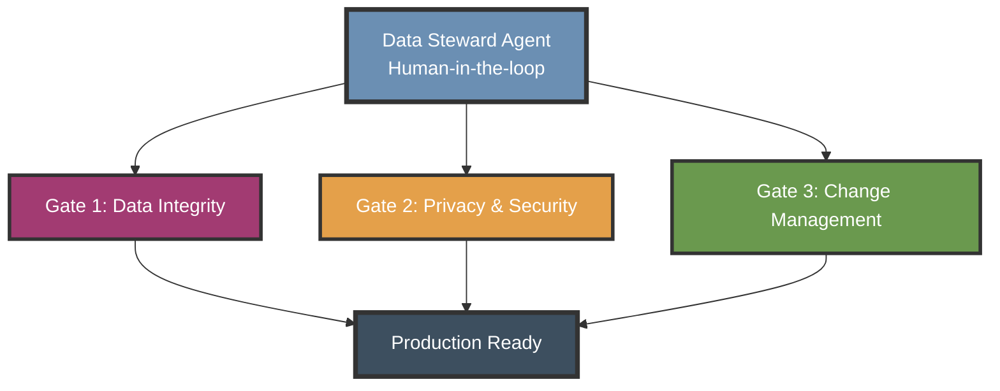

# Data Steward Agent


**A governance agent that profiles, cleans, and documents datasets — with a human in the loop.**
By [Skylark 118 LLC](https://skylark118.com) · Version 1.0

---

## What this is

The **Data Steward Agent** is a runnable data-governance agent for SaaS products.
It acts as a **blocking gate**: no data feature ships until integrity, privacy, and
change control are validated — and it never mutates data without explicit human approval.

This repo ships the agent in three forms:

| File | For |
|------|-----|
| [`AGENTS.md`](AGENTS.md) | **Canonical agent definition** — the portable [AGENTS.md](https://agents.md) spec any harness can read (Claude Code, Codex, Cursor, Aider…) |
| [`.claude/agents/data-steward.md`](.claude/agents/data-steward.md) | **Runnable Claude Code subagent** — drop-in, invoke as `data-steward` |
| [`docs/methodology.md`](docs/methodology.md) | The full methodology the agent runs on (the 3 gates, in depth) |

Most data governance is either too enterprise (500-page manuals) or too vague
(generic checklists). This is the essential 20% that delivers 80% of the value,
packaged as an agent instead of a PDF.

---

## How it works — three gates

The agent enforces three sequential validation gates. Each has a STOP condition;
nothing advances until the current gate passes.



1. **Data Integrity** — required fields, referential integrity, formats, documentation
2. **Privacy & Security** — PII classification, legal basis, tested deletion (GDPR/CCPA)
3. **Change Management** — schema version control, paired forward/rollback migrations, impact assessment

Full procedure and rationale: [`docs/methodology.md`](docs/methodology.md).

---

## Quick start

### See it work in 30 seconds (no install)

Run the gates against a seeded dataset — pure Python standard library, no
dependencies:

```
python3 demo/run_gates.py
```

You'll see the steward **BLOCK** a dataset with seeded violations (null required
fields, orphaned records, undocumented PII, a migration with no rollback). Run
`python3 demo/run_gates.py --scenario clean` to watch all three gates pass. Full
walkthrough and captured output in [`demo/`](demo/).

### Run it in Claude Code

1. Copy the agent definition into your project:
   - `AGENTS.md` (or merge it into your existing one)
   - `.claude/agents/data-steward.md`
2. Ask Claude Code to run the `data-steward` subagent against your dataset.
3. The agent profiles read-only, then **pauses for your approval** before any
   deletion or migration.

### Run it in any other harness

Point your agent at [`AGENTS.md`](AGENTS.md) as the system prompt. Wire its
write/DDL tools to a **require-approval** policy (see the SDK note below).

### Use the framework by hand

1. Read the [methodology](docs/methodology.md) and follow the [4-week implementation guide](docs/implementation-guide.md)
2. Copy and fill the templates:
   - [PII inventory](templates/pii-inventory.yml)
   - [Data dictionary](templates/data-dictionary-template.md)
   - [Schema change record](templates/schema-change-template.md)
   - [Deletion test checklist](templates/deletion-test-checklist.md)
3. Run the [validation queries](scripts/validation-queries.sql)

---

## Run it

### Human-in-the-loop is the whole point

The Data Steward is a *governance* agent: it investigates and **proposes**, and a
human approves before anything consequential (deletion, migration, any write). The
pattern is the same in every harness — gate the write tools behind an approval step.

### Minimal SDK example (TypeScript)

Install the official SDK — `npm install @anthropic-ai/sdk` (Python: `pip install anthropic`).
The snippet below shows the core idea: a tool-use loop that **requires human
approval before executing any write tool**. The system prompt is the agent
definition from this repo.

```ts
import Anthropic from "@anthropic-ai/sdk";
import { readFileSync } from "node:fs";

const client = new Anthropic();
const systemPrompt = readFileSync("AGENTS.md", "utf8"); // the agent definition

// Tools the Data Steward can call. Reads run freely; writes need a human.
const WRITE_TOOLS = new Set(["run_write_sql"]); // delete / migrate / anonymize

async function approve(toolName: string, input: unknown): Promise<boolean> {
  // Replace with your real approval UI / Slack prompt / CLI confirm.
  console.log(`Approval needed for ${toolName}:`, input);
  return /* await human decision */ false;
}

// In your tool-use loop, before executing a tool the model requested:
async function executeTool(toolName: string, input: unknown) {
  if (WRITE_TOOLS.has(toolName) && !(await approve(toolName, input))) {
    return { error: "Denied by human reviewer — action not taken." };
  }
  // ...run the read-only or approved tool...
}
```

This approval gate is harness-agnostic and works with any model loop. For
Anthropic's **hosted** Agents (managed permission policies, where `always_ask`
pauses a session for confirmation server-side), see the official docs:
[permission policies](https://platform.claude.com/docs/en/managed-agents/permission-policies)
· [agent setup](https://platform.claude.com/docs/en/managed-agents/agent-setup).

---

## Repository contents

```
data-steward-agent/
├── AGENTS.md                          # Canonical agent definition (portable)
├── .claude/agents/data-steward.md     # Runnable Claude Code subagent
├── docs/
│   ├── methodology.md                 # The 3-gate framework, in full
│   └── implementation-guide.md        # 4-week human rollout plan
├── templates/                         # The agent's output artifacts
│   ├── pii-inventory.yml
│   ├── data-dictionary-template.md
│   ├── schema-change-template.md
│   └── deletion-test-checklist.md
├── scripts/validation-queries.sql     # Gate 1–3 check suite (a tool the agent runs)
├── demo/                              # Runnable proof — seeds bad data, runs the gates
│   ├── run_gates.py                   #   zero-dependency demo (Python stdlib)
│   └── sample-report.md               #   captured PASS/BLOCK output
├── LICENSE                            # MIT
└── DISCLAIMER.md                      # Not legal advice
```

---

## Why it matters

Every SaaS product eventually hits data-governance failures: bad data quality
breaks analytics; missing privacy controls invite fines (GDPR: up to 4% of
revenue); no deletion capability is legal liability; uncontrolled schema changes
cause outages. This agent is built to catch those *before* they ship.

Distilled from real production work in a multi-tenant SaaS product handling
sensitive health data — practice, not theory.

---

## When to expand beyond core

Start with the three gates. Add enterprise features only when you need them:

- **Performance monitoring** → when queries regularly exceed 1 second
- **Advanced backup/DR** → when preparing for compliance audits
- **Detailed audit logging** → when sensitive-data access must be tracked
- **Quarterly compliance reviews** → when regulations require formal audits

---

## Contributing

Improvements welcome. Please:
1. Keep the framework focused — resist feature bloat
2. Prioritize practicality over comprehensiveness
3. Include a working example with your PR

---

## License

MIT — use freely. See [LICENSE](LICENSE). This repository is not legal, privacy,
or compliance advice; see [DISCLAIMER.md](DISCLAIMER.md).

---

*Built by [Skylark 118 LLC](https://skylark118.com). Need help putting governance
guardrails on your product or your agents? [Work with Skylark 118 →](https://skylark118.com/built)*
